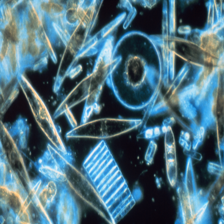
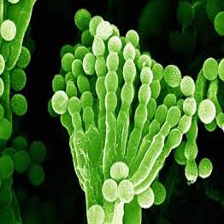
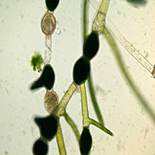
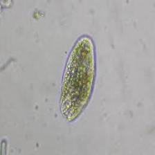
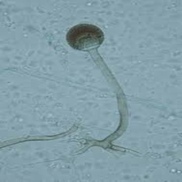
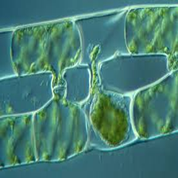
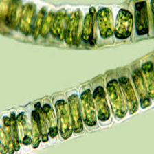
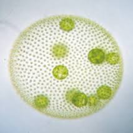
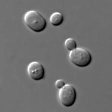

# Microorganisms Classification Project

This project implements a machine learning-based system for classifying microorganisms using a Random Forest Classifier. The system provides multiple interfaces through Streamlit and Flask frontends with a FastAPI backend.

<div align="center">
  <table>
    <tr>
      <td align="center">
        <br>
        Aspergillus sp
      </td>
      <td align="center">
        <br>
        Diatom
      </td>
      <td align="center">
        <br>
        Penicillum
      </td>
      <td align="center">
        <br>
        Pithophora
      </td>
      <td align="center">
        <br>
        Protozoa
      </td>
    </tr>
    <tr>
      <td align="center">
        <br>
        Raizopus
      </td>
      <td align="center">
        <br>
        Spirogyra
      </td>
      <td align="center">
        <br>
        Ulothrix
      </td>
      <td align="center">
        <br>
        Volvox
      </td>
      <td align="center">
        <br>
        Yeast
      </td>
    </tr>
  </table>
</div>

## 🛠️ Tech Stack

- **Backend**: FastAPI
- **Frontend**: Streamlit, Flask
- **Machine Learning**: scikit-learn (Random Forest Classifier)
- **Data Processing**: pandas
- **Containerization**: Docker
- **Development**: Python 3.x

## 🎯 Demo Links

You can try out our application through the following interfaces:

- **Streamlit App**: [Streamlit Demo](https://microorganisms.streamlit.app)
- **Flask App**: [Flask Demo](https://flask-317097237537.europe-west1.run.app)
- **API Documentation**: [FastAPI Docs](https://fast-317097237537.europe-west1.run.app/redoc)

## 🔧 Installation

1. Clone the repository:
```bash
git clone https://github.com/yourusername/microorganisms.git
cd microorganisms
```

2. Create and activate a virtual environment:
```bash
python -m venv venv
source venv/bin/activate  # On Windows: venv\Scripts\activate
```

3. Install dependencies:
```bash
pip install -r requirements.txt
```

## 🚀 Usage

### Running the Streamlit App
```bash
streamlit run streamlit_app.py
```

### Running the Flask App
```bash
python flask_app.py
```

### Running the FastAPI Backend
```bash
uvicorn api.main:app --reload
```

### Using Docker
```bash
docker build -t microorganisms .
docker run -p 8000:8000 microorganisms
```

## 📁 Project Structure

```
microorganisms/
├── api/                 # FastAPI backend
├── data/               # Dataset and data processing scripts
├── models/             # Trained models
├── notebooks/          # Jupyter notebooks for analysis
├── static/             # Static assets
├── templates/          # Flask templates
├── flask_app.py        # Flask frontend
├── streamlit_app.py    # Streamlit frontend
├── requirements.txt    # Project dependencies
├── Dockerfile         # Docker configuration
└── Makefile          # Build automation
```

## 🤝 Contributing

Contributions are welcome! Please feel free to submit a Pull Request.

## 👥 Authors

- Jeremy Pahler
- Mathieu Jayet
- Augustin Morval